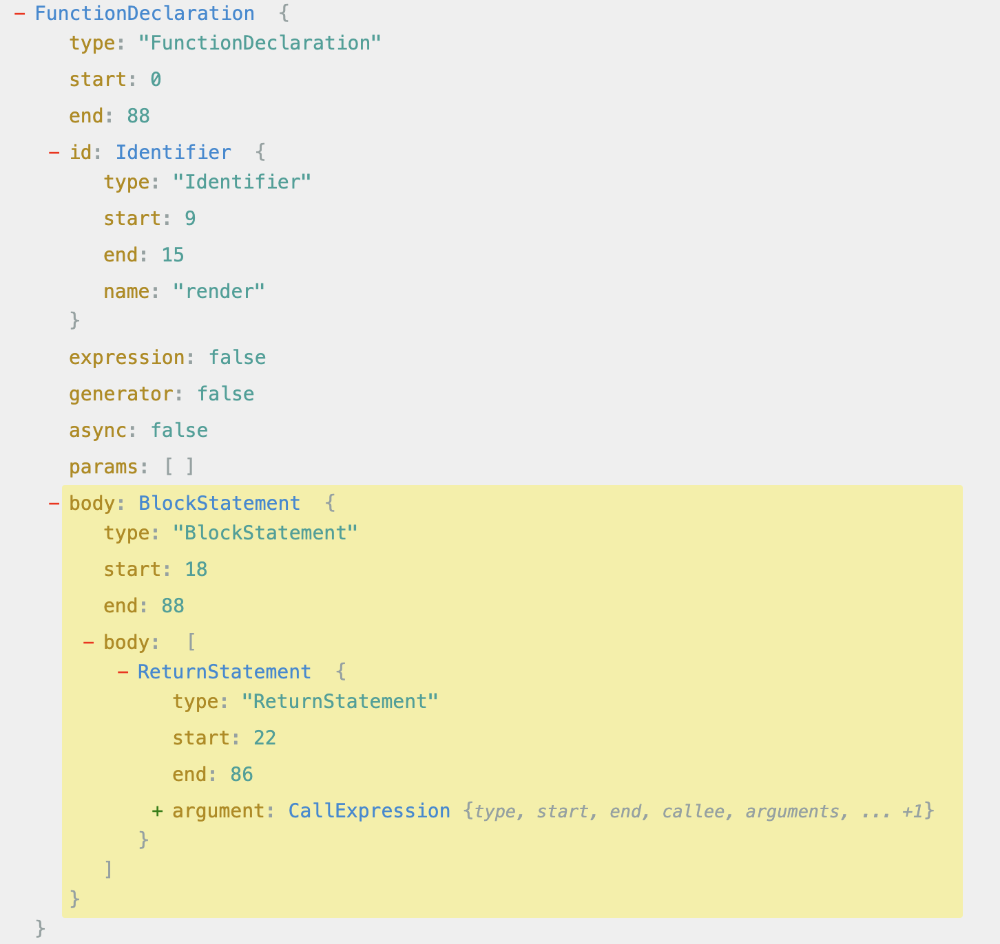

# 模板编译

整体过程：

1. 模板 => `模板 AST`
2. `模板 AST` => `JavaScript AST`
3. `JavaScript AST` => `render函数`


## 1.解析

### 模板 AST

这一步是将模板字符串解析为“模板 AST”，那首先要知道“模板 AST”的样子，它的数据结构。

使用 [代码转换 AST 的在线工具：astexplorer.net](https://astexplorer.net/)，查看模板对应的 AST。

```html
<div>
  <h1 v-if="ok">Vue Template</h1>
</div>
```

以上模板对应的模板 AST 如下，它结构上和 Vnode 类似，但是二者并不是一个东西，例如数据结构方面 type 的取值就有很大差异，使用场景也完全不同，不要混为一谈。

它也是树形的，和模板是同构的，使用 js 对象的方式描述的模板。

```javascript
const ast = {
  // 逻辑根节点
  type: 'Root',
  children: [
    // div 标签节点
    {
      type: 'Element',
      tag: 'div',
      children: [
        // h1 标签节点
        {
          type: 'Element',
          tag: 'h1',
          props: [
            // v-if 指令节点
            {
              type: 'Directive', // 类型为 Directive 代表指令
              name: 'if', // 指令名称为 if，不带有前缀 v-
              exp: {
                // 表达式节点
                type: 'Expression',
                content: 'ok',
              },
            },
          ],
        },
      ],
    },
  ],
};
```

### parse

这一步解析用到的函数是`parse`，它的主要功能是标记化`tokenized`，然后构造模板 AST。

#### 标记化

标记化就是将模板，拆分成一个个的最小单元，方便于后续的 AST 构造。

```html
<div>Vue</div>
```

以上模板，将它们标记化后得到的标记（Token）是这样的：

```javascript
{ type: 'tag', name: 'div' }
{ type: 'text', content: 'Vue' }
{ type: 'tagEnd', name: 'div' }
```

这一步的实现使用到了**有限状态机**。

#### AST 构造

使用 Token 构造模板 AST。因为是树形结构，所以要遍历 Token 列表，然后使用**栈**来构造（遇到开始标签入栈，遇到结束标签出栈）。

## 2. 转换

### 2.1 目标代码数据结构

转换：模板 AST => JS AST，对应的函数`transform`。

JavaScript AST 的数据结构，我们让然需要通过[代码转换 AST 的在线工具：astexplorer.net](https://astexplorer.net/)来查看。
复制我们的模板编译的最终目标代码——render 函数，将其贴到在线工具左侧，右侧就是其对应的"JavaScript AST"，即我们这一步转换的目标代码。

例如：

```html
<div>
  <p>Vue</p>
  <p>Template</p>
</div>
```

对应的 render 函数:

```javascript
function render() {
  return h('div', [h('p', 'Vue'), h('p', 'Template')]);
}
```

render 函数对应的“JavaScript AST”是这样的：


### 2.2 节点访问

转换的过程，因为“模板 AST”是树形的结构，所以我们需要**递归**（深度优先）遍历每个节点。

#### 2.2.1 递归访问节点

```javascript
function traverseNode(ast) {
  const currentNode = ast;

  // 转换标签处理逻辑

  // 转换文本处理逻辑

  const children = currentNode.children;
  for (let i = 0; i < children.length; i++) {
    traverseNode(children[i]);
  }
}
```

#### 2.2.2 插件化

AST 节点的类型有很多，每种都有各自的转换逻辑，都放到 trasverseNode 函数中是比较难以维护的。
我们可以将其插件化，每种类型节点的转换函数当做一个插件：`transformElement`、`transformText`等。将所有转换插件放到一个数组中，然后在`trasverseNode`中遍历数组调用转换插件。

#### 2.2.3 转换上下文

上下文可以理解为是一定范围内的全局变量。“转换上下文”就是在转换函数中（`trasverseNode`、`transformElement`、`transformText`）用到的全局变量。

全局上下文`context`它包含的内容，即它的数据结构：

```javascript
const context = {
  currentNode: null, // 当前的节点
  childIndex: 0, // 当前节点在父节点儿子列表中的索引
  parent: null, // 父节点
  nodeTransforms: [
    // 转换函数列表
    transformElement,
    transformText,
  ],
};
```

一定范围，这个“范围”需要在每次访问节点的时候（`trasverseNode`中）设置，转换函数调用的时候传入上下文`context`，转换函数中使用。

```javascript
function traverseNode(ast, context) {
  context.currentNode = ast; // 设置

  const transforms = context.nodeTransforms;
  for (let i = 0; i < transforms.length; i++) {
    transforms[i](ast, context); // 使用
  }

  const children = currentNode.children;
  for (let i = 0; i < children.length; i++) {
    context.parent = context.currentNode; // 设置
    context.childIndex = i; // 设置
    traverseNode(children[i], context);
  }
}
```
